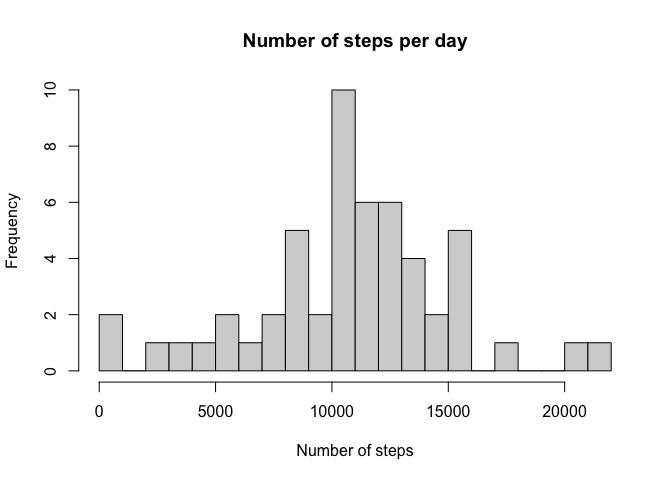
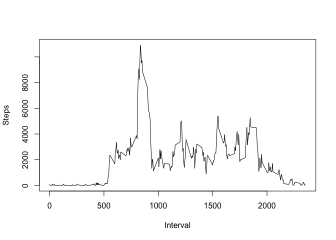
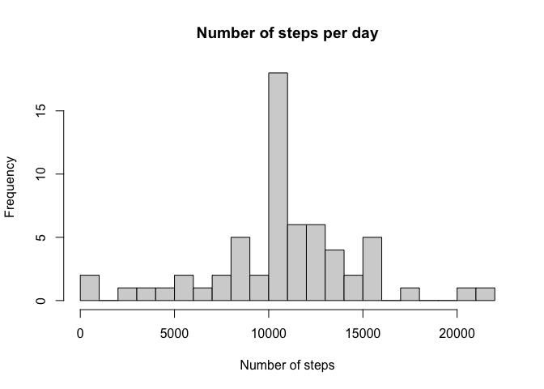
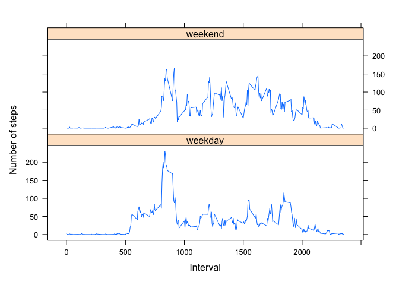

## Loading and preprocessing the data


```r
library(ggplot2)
unzip("activity.zip")
steps <- read.csv("activity.csv", colClasses = c("numeric", "Date", "numeric"))
stepsNoNA = steps[!is.na(steps$steps), ]
```

## What is mean total number of steps taken per day?

Histogram of the number of steps per day listed by frequency.


```r
stepsbyday <- aggregate(steps~date, stepsNoNA, sum)
names(stepsbyday) <- c("date", "steps")
hist(stepsbyday$steps, breaks = 20, xlab = "Number of steps", 
     main = "Number of steps per day")
```

<!-- -->

Calculating the median and the mean

```r
median_steps <- median(stepsbyday$steps)
mean_steps <- mean(stepsbyday$steps)
```

The median number of steps taken is: 1.0765\times 10^{4} where as the mean number of 
taken are 1.0766189\times 10^{4}.

## What is the average daily activity pattern?


```r
steps_by_interval <- aggregate(steps$steps, list(steps$interval), 
                               FUN = sum, na.rm = T)
names(steps_by_interval) <- c("interval", "steps")
plot(steps_by_interval$interval, steps_by_interval$steps, type="l", 
     ylab = "Steps", xlab = "Interval")
```

<!-- -->

```r
avg_steps_by_interval <- aggregate(steps$steps, list(steps$interval), 
                               FUN = mean, na.rm = T)
names(avg_steps_by_interval) <- c("interval", "steps")

max_steps <- max(avg_steps_by_interval$steps)
max_interval <- avg_steps_by_interval[which.max(avg_steps_by_interval$steps), 1]
```

Interval 835 has the highest average number of steps, which is 
206.1698113.

## Imputing missing values


```r
missing_values <- length(which(is.na(steps$steps)))
```

There are 2304 in the dataset.

I will be using the Mean of the 5 minute interval to fill in the missing values.  I chose this
because I am assuming that the person is doing the same thing each day so using that 5 min
interval would be a close match.


```r
naIndex <- which(is.na(steps$steps))
naInterval <- steps[naIndex, 3] 
imputedSteps <- sapply(naInterval, function(x) { avg_steps_by_interval[(avg_steps_by_interval$interval==x), 2]})
```

Next I fill in the NAs with my interval averages


```r
noNASteps <- steps
noNASteps[naIndex, 'steps'] <- imputedSteps 
```

Now I recalculate the average

```r
imputedStepsbyday <- aggregate(steps~date, noNASteps, sum)
names(imputedStepsbyday) <- c("date", "steps")
hist(imputedStepsbyday$steps, breaks = 20, xlab = "Number of steps", 
     main = "Number of steps per day")
```

<!-- -->

Calculating the median and the mean

```r
imputed_median_steps <- median(imputedStepsbyday$steps)
imputed_mean_steps <- mean(imputedStepsbyday$steps)
```

The new median number of steps taken is: 1.0766189\times 10^{4} where as the new mean number of 
taken are 1.0766189\times 10^{4}.

The mean number of steps taken per day are the same. 
The median number of steps taken are different after filling in missing data.


## Are there differences in activity patterns between weekdays and weekends?

Create a new feature to store if a day is a weekday or weekend.

```r
noNASteps['typeofday'] <- factor(sapply(noNASteps$date, function(x){ if (weekdays(x) == "Sunday" 
                                                                      | weekdays(x) == "Saturday") { "weekend" }                                                                    else { "weekday"} }))
```

Now get the average by type of day

```r
avgStepByTypeOfDay <- aggregate(steps~interval + typeofday, mean, data=noNASteps)
library(lattice)
xyplot( steps ~ interval | typeofday, data = avgStepByTypeOfDay, type="l", layout=c(1,2), xlab="Interval", ylab="Number of steps")
```

<!-- -->
